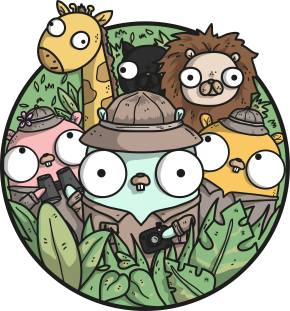

# Go Explore

Text based adventure game framework written in Go



*Image credit: [Ashley McNamara](https://github.com/ashleymcnamara/gophers)*

## Quick Start Guide

You can download the latest release and run the executable to play the example game

[Click here to download the latest release](https://github.com/lukemerrett/go-explore/releases/download/1.3/go-explore.zip)

To configure your own scenes, read the "Configuring The Scenes" guide below

## Getting Started From Source

1. [Download and install Golang](https://golang.org/doc/install)
2. Set up and navigate to your `%GOPATH%` root
    1. [Follow the instructions here if you haven't done this before](https://golang.org/doc/install)
3. Run `go get github.com/lukemerrett/go-explore` to clone into `src/github.com/lukemerrett/go-explore`
4. CD into `src/github.com/lukemerrett/go-explore`
5. Run `go build`
6. Run `go-explore.exe`

## Configuring The Scenes

All the scenes and transitions are configured through a YAML file found in `resources/game-data.yaml`.

The format is:

```yaml
Configuration:
  Output Type: Console        # Only supports "Console" at the moment
Scenes:
  Scene Key:
    Title: Title of Scene
    Body: Body Text of Scene
    Start Scene: true         # Can be true or false, if not specified, defaults to false
    End Scene: false          # Can be true or false, if not specified, defaults to false
    Transitions:
      Scene Key: Text For Transition
```

For example:

```yaml
Configuration:
  Output Type: Console
Scenes:
  Home:
    Title: Your home
    Body: A house on a street in a neighbourhood
    Start Scene: true
    Transitions:
      Garden: Go to the garden
      Hallway: Go inside the house
  Hallway:
    Title: Hallway
    Body: The inside hallway of the house
    Transitions:
      Upstairs: Go upstairs
      Home: Go back outside
  Upstairs:
    Title: Upstairs
    Body: The landing is empty
    End Scene: True
  Garden:
    Title: Your garden
    Body: The garden at the back of the house
    Transitions:
      Home: Go to the front door
```

If you want to add multi-line text with line breaks in yaml, use this format:

```yaml
  Garden:
    Title: Your garden
    Body: |
          The garden at the back of the house
          The shed lies empty and unused
    Transitions:
      Home: Go to the front door
```
